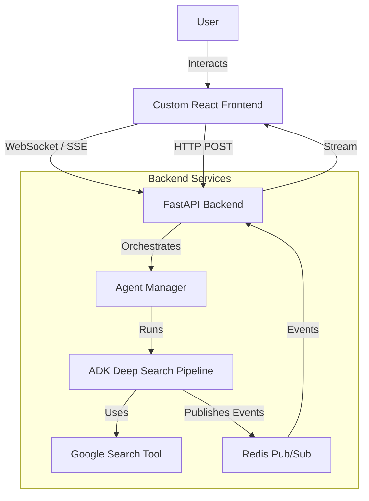

# Alternate Architecture: ARGOS POC without CoPilotKit and Tavily

## 1. Executive Summary
This document outlines the architecture for the ARGOS POC (Proof of Concept) removing the dependencies on **CoPilotKit** and **Tavily**.
*   **Tavily** will be replaced by the **Google ADK Deep Search** agent pipeline, utilizing Google Search.
*   **CoPilotKit** will be replaced by a **Custom React Frontend** communicating with the backend via **WebSockets (or SSE)** for real-time streaming of agent thoughts, search results, and chat responses.

## 2. System Architecture

### 2.1. High-Level Diagram


## 3. Component Details

### 3.1. Backend (Python/FastAPI + ADK)

#### 3.1.1. Search Provider Replacement
*   **Current**: `TavilyClient` via MCP.
*   **New**: `google.adk.tools.google_search`.
*   **Implementation**:
    *   Integrate the `deep-search` agent logic from `adk-python-examples`.
    *   Configure `google_search` with `GOOGLE_API_KEY` and `GOOGLE_CSE_ID`.

#### 3.1.2. Agent Pipeline (The "Deep Search" Logic)
Instead of a single agent loop, we will adopt the ADK `research_pipeline` structure:
1.  **Planner**: Generates a research plan.
2.  **Researcher**: Executes Google Searches and summarizes findings.
3.  **Evaluator**: Critiques findings and loops if necessary.
4.  **Composer**: Generates the final markdown report.

#### 3.1.3. Communication Layer (Replacing CopilotKit Runtime)
We need a standard way to stream the agent's "thinking" and "results" to the UI.
*   **Endpoint**: `GET /ws/chat/{session_id}` (WebSocket) or `GET /stream/{session_id}` (SSE).
*   **Event Format**: JSON messages.
    ```json
    {
      "type": "thought" | "tool_call" | "tool_result" | "message" | "error",
      "content": "...",
      "agent_name": "section_researcher",
      "timestamp": "..."
    }
    ```
*   **Redis Integration**:
    *   The ADK agents will use a custom `callback` (like `collect_research_sources_callback`) to publish events to Redis channel `session:{session_id}:events`.
    *   The WebSocket endpoint subscribes to this channel and forwards messages to the client.

### 3.2. Frontend (React)

#### 3.2.1. Removing CopilotKit
*   **Remove**: `<CopilotKit>`, `<CopilotSidebar>`, `useCoAgent`, `useCopilotChat`.
*   **Add**: Custom components.

#### 3.2.2. New Components
1.  **`ChatInterface`**:
    *   A standard chat window (Message List + Input Area).
    *   Maintains local state `messages: Message[]`.
    *   Renders Markdown (using `react-markdown`).
2.  **`ResearchDashboard`** (The "Shared State" Replacement):
    *   Instead of syncing a hidden state object, this component listens for specific event types (e.g., `research_plan_updated`, `sources_found`).
    *   **State**:
        *   `currentPlan`: Display the active research plan.
        *   `sources`: List of found URLs/Papers.
        *   `status`: Current agent action (e.g., "Searching Google for...", "Reading PDF...").

#### 3.2.3. Client Logic
*   **Connection**: On load, establish WebSocket connection to backend.
*   **Sending**: `sendMessage(text)` sends a JSON payload over the socket.
*   **Receiving**:
    *   `onMessage`: Parse JSON.
    *   If `type === 'message'`, append to chat.
    *   If `type === 'thought'`, show in a "Thinking" collapsible section.
    *   If `type === 'tool_result'`, update the `ResearchDashboard` (e.g., add new source).

## 4. Implementation Plan

### Phase 1: Backend Refactoring
1.  **Port Deep Search**: Copy `adk-python-examples/python/agents/deep-search/app` logic into `ARGOS_POC/src/agents/deep_search`.
2.  **Remove Tavily**: Delete `mcp_client.py` (Tavily references) and `search_and_parse` tool.
3.  **Setup Google Search**: Ensure `google_search` tool is configured.
4.  **Create Event Bus**: Implement a simple wrapper around `redis_client` to publish standardized agent events.
5.  **API Endpoints**: Create the WebSocket/SSE endpoint in `main.py`.

### Phase 2: Frontend Refactoring
1.  **Clean Up**: Uninstall `@copilotkit/*` packages.
2.  **Build Chat UI**: Create `src/components/Chat/ChatWindow.tsx`.
3.  **Build Dashboard**: Update `src/components/ResearchDashboard.tsx` to accept props/context from the WebSocket stream instead of `useCoAgent`.
4.  **Integration**: Connect Frontend to Backend WebSocket.

## 5. Feasibility Assessment
*   **Technical Risk**: Low. The technologies (WebSockets, React, Google Search) are mature.
*   **Effort**: Medium. Requires writing the UI code that CopilotKit provided for free, but yields significantly higher maintainability and customization.
*   **Benefit**:
    *   **Decoupling**: No vendor lock-in to CopilotKit.
    *   **Simplicity**: Clearer data flow (Events vs. "Shared State" magic).
    *   **Capability**: ADK Deep Search is more powerful than the previous simple Tavily loop.

## 6. Conclusion
This architecture provides a robust, scalable, and "standard" way to build the ARGOS agent, aligning with the goal of using Google's ADK effectively while simplifying the dependency stack.
